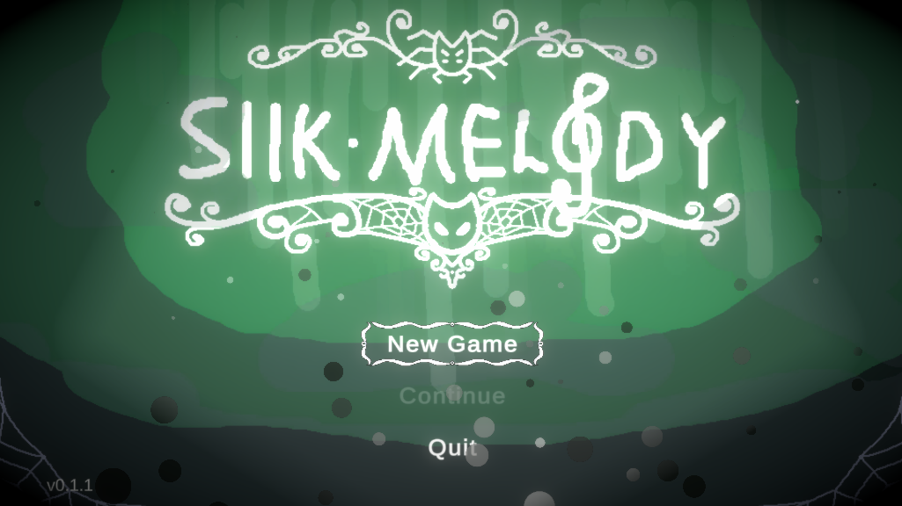
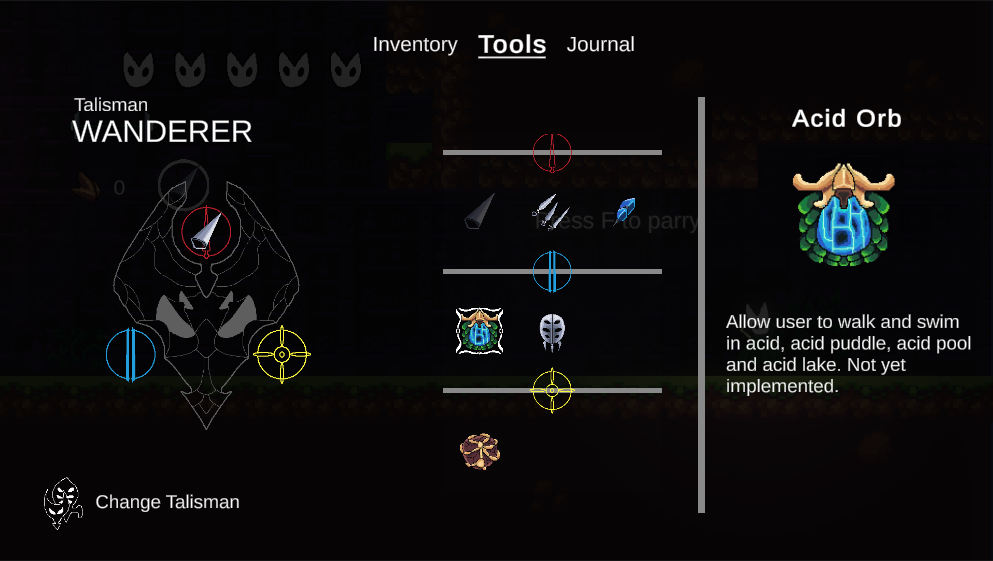
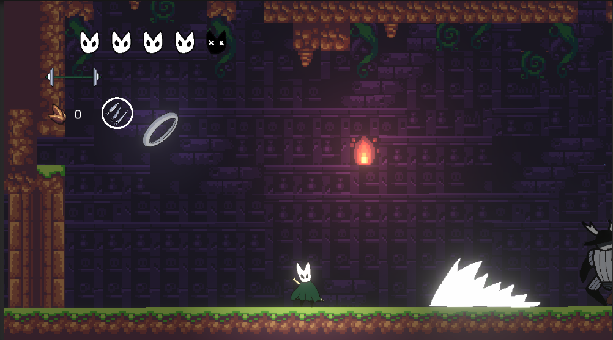
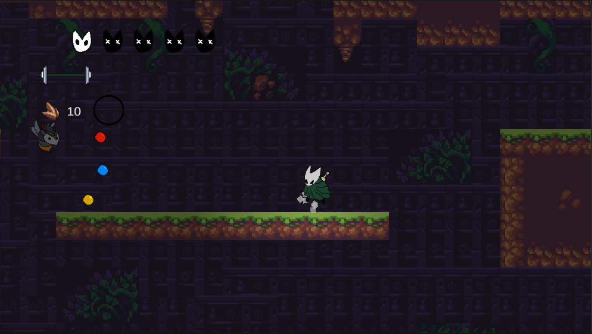

# Silk Melody

## Summary

A bootleg game.

## Table of contents

- [Table of contents](#table-of-contents)
- [Demo image](#demo-images)
- [Control](#control)
- [Get the demo](#get-the-demo)
- [Design document](#design-document)
- [Resources](#resources)

## Demo images

## Control

Jump near ledge to grab them.

Hold Jump to jump higher.

Attack while holding up arrow to do an upward attack.

Attack while holding down arrow and midair to do an pogo attack.

Silk skill:

- No vertical input: Heal 3HP. Cost 8 silk.

- Up input (press silk skill while holding up): Gossamer Storm. Cost 6 silk.

- Down input: Silk Burst projectile. Cost 4 silk.

### Keyboard

- X - Jump.
- Q - Silk skill
- F - Parry
- C - Attack
- Z - Dash
- V - Use tools
- I - Open inventory

### Xbox

- A - Jump
- X - Attack
- B - Silk skill
- Y - Parry
- RT - Dash
- LB - Use tools
- Start - Menu

## Get the Demo

### Option 1: Check the Release tab

Here you will find the version of the game that is stable, mostly bug-free and is updated when the game development reaches certain milestone. The version is put up by the author themself.

### Option 2: Get the Nightly Build

Navigate to the **Actions** [tab](https://github.com/lamnguyenkhoa/SilkMelody/actions) of the repo, here you will find a list of all the builds' result, each build takes place when a code push happens, so you can try out the new changes, or browse previous builds.

Let's assume you want the lastest build, click on the first one from top to bottom with the green checkmark. It will bring you to the `Action's result` page, here you can find builds for various systems that will suit your needs.

## Design document

Trello link: <https://trello.com/b/y4U81oTS/silkmelody>

Map diagram: <https://drive.google.com/file/d/1FNvQ1Rmx9jhIjlrh_A7A3vSlKeX5K8J0/view?usp=sharing>

### Packages used

- Cinemachine
- InputSystem
- URP
- A\* Pathfinding

## Resources

- Loot sound <https://freesound.org/people/LittleRobotSoundFactory/sounds/276097/>
- Batter's boss theme <https://www.youtube.com/watch?v=V81DlvZkxGE&ab_channel=wickedslicks1003>
- Main menu theme <https://www.youtube.com/watch?v=xwX84zgO_Cw&list=PLDisKgcnAC4QMlOXULG2QvT9yvJMTQH3_&index=2&ab_channel=OriginalSoundtrack>
- Impact SFX <https://www.youtube.com/watch?v=ILtw7SKMjCQ&ab_channel=SoundEffect>
- Dirt cave ambient soundtrack <https://freesound.org/people/LittleRobotSoundFactory/sounds/270387/>
